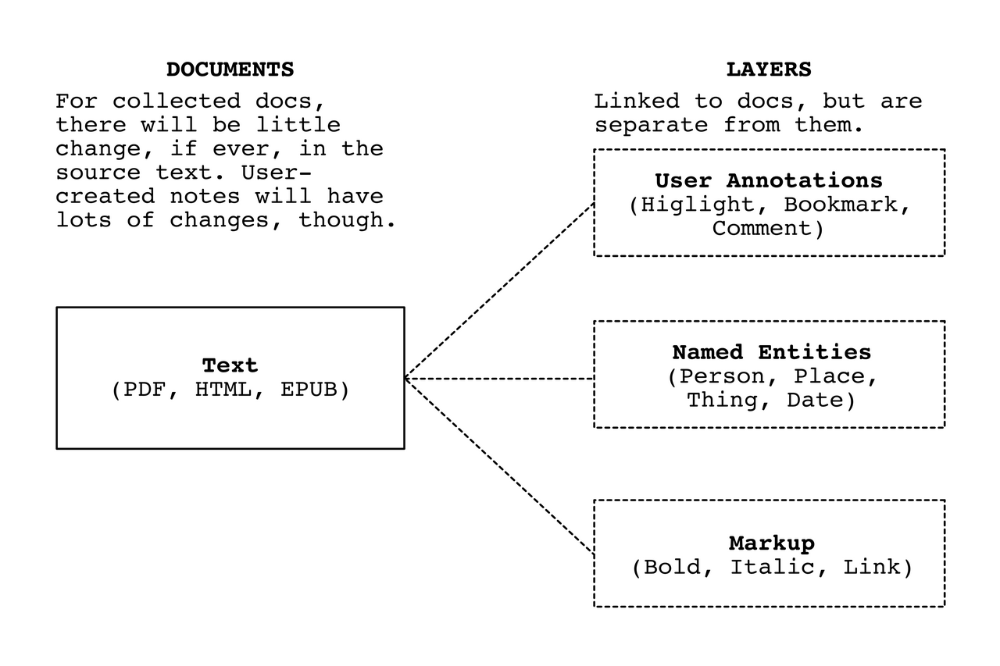

There is no lack of Tools for Thought (TfT) applications today, but all of them require you to store all your data in one application. What if we could figure out a way to use different apps for different tasks but work from the same documents and data?

## Motivation

I am a history buff. Not in the normal way of going to museums or watching documentaries, but in the way of searching for hours through digital newspaper archives looking for certain information to answer a question and then writing about what I found.

I used to use Evernote as a system for managing research for history writing. Evernote has an excellent web clipper, so it was really easy to get things into it. It was not so easy to do anything with the notes and files when they were inside it. I tried creating an elaborate system of notebooks (folders) and tags and internal links, but it became obvious that the app was not meant for that level of use.

Evernote can store any kind of file, but it can only open a handful of file types. I would open the different file types in separate reader apps, each of which had a unique annotation system. I was able to get Evernote to pull in most of the annotations using various hacks, but the sync was one-directional and the annotations were not linked back to the source.

I built a system on top of Sanity, which is a hosted, headless CMS. It was really easy to create data types, so I could have entities like people, places, or dates that could be linked to in blog posts. They have a powerful query language, so I was able to list all posts that mentioned an entitiy. I created an auto-fill component in the CMS that would let you search Wikidata for an entity and it would populate information, like name, date of birth, and a description. I also started building a web clipper that would help me collect data into the system.

At first, I liked the system and was able to use it post some research, but I eventually decided to move away from this solution, too. Besides some quirks and limitations in the API (some of which have been fixed since I tried the project), the main issues I had with the platform were that it wouldn't work offline and the only option was for Sanity to host your data.

## Guiding ideas

My goal is for researchers to be able to collect digital sources (websites, documents, media files, and named entities), make annotations on any file type, use these sources and annotations in their writing, and then link back to the original sources.

### Avoid lock-in

I have heard about some powerful and popular Tools for Thought applications. I haven't deeply used any of them, because, after my experience with Evernote, I am afraid of getting locked into something that doesn't quite meet my needs. I want to explore ways for people to be able to use my apps without feeling that it is all or nothing.

### Small apps for specific tasks

In the old days when we had all our files on our local hard drives, we could use many small applications that had very specific uses. I want to try to capture that flexibility and interoperability between apps. Instead of creating one app that does all the things I need, I can create smaller apps that handle specific activities but can all understand the same files and data.

Smaller apps also mean faster development time and they avoid the complexity and slowness that can come with apps that try to do too much.

### Interoperability

If each tool is opt-in, then other developers could create apps that work in the ecosystem. The user could use them without having to stop using the other apps they have been using. To increase this possibility of interoperability, as much as possible, I want to take advantage of standards like RDF or JSON-LD.

## Components of the ecosystem

These are the current pieces of the ecosystem that I am working towards:

1. **Web Clipper** - Save web pages, PDFs, EPUBs, and media files. I have started on this and have a [basic implementation](https://github.com/delightful-labs/delightful-clipper) (almost) working.

2. **Reader** - Read all different files with user preferences and the ability to highlight and annotate. Annotations also can include Named Entity Recognition to find names of people and places in the content. I currently have a basic reader (without annotations) combined with the clipper, though they will probably be separated at some time.

3. **Annotation manager** - A way to view all your annotations in one place. This would probably be a stepping stone to the studio, as mentioned in the next point.

4. **Authoring Studio** - Write and combine annotations into notes or blog posts. I imagine something close in concept to current TfTs like Roam or Tana.

Besides these, the possibilities are many, including Dropbox-like local sync or an app that would take a video or audio file, create a transcript with voice-to-text, and then allow annotations on the content.

## Technical foundations

- **Content addressing** (IPFS, WNFS) - If I have a copy of a PDF and you have a copy, then we can "talk" about the same file. This will also increase the lifetime of a source document because multiple people can host the file (this cuts down on link rot).
- **Stand-off properties** ([atJSON](https://github.com/condenast/atjson), [W3C web annotations](https://w3c.github.io/web-annotation/model/wd2/)) - To preserve content addressing, we want to manipulate source documents as little as possible. Stand-off properties allow each user to have their own annotations on a shared document. These properties are essentially optional _layers_ on top of the source document. 
- **Semantic data** (RDF, JSON-LD) - There have to be ways for other applications to know what is being talked about. It will also allow you to find relations between items that you have collected.
- **Collaboration/interoperability** (Activity Pub, Linked Data Notifications) - This would allow people to join groups and get notifications when someone made annotations on a document I have an interest in.
- **Offline access** (WNFS) - It is important for me that apps are fast and accessible at all times because I spend a lot of time in Africa where there is metered and sometimes spotty network access.

## Conclusion

I have been working on this part-time as a side project when I am not working for my day job as a front-end developer. Inspired by Linus Lee's ideas of creating tools that you would use yourself, I am trying to get to what I am calling MMP (Minimum Matt Product) so that I can use these tools in my research and everyday reading. If I can get it to where I will use it every day, then I will keep working out the details so that it can be usable by more people.
